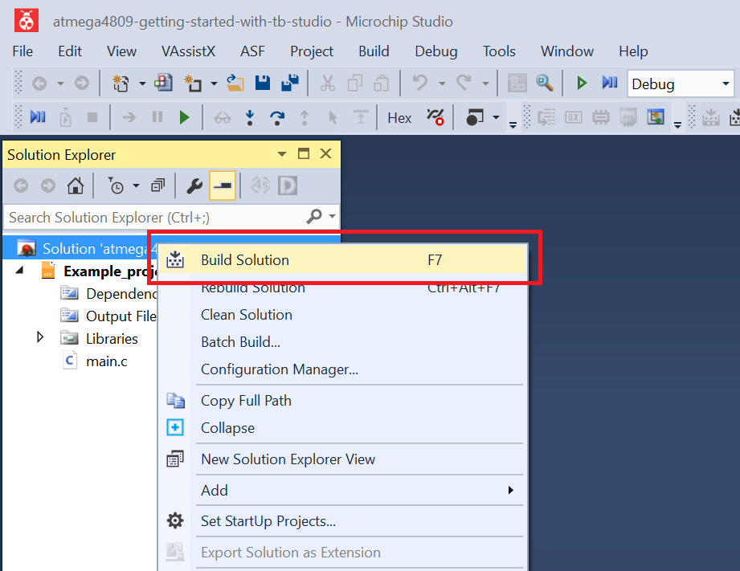
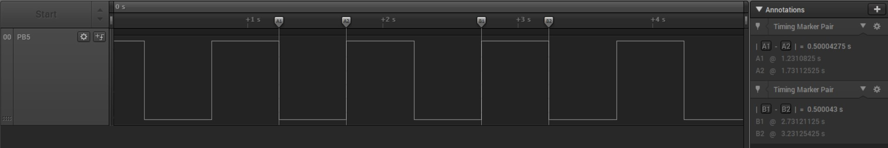

 # Overflow Interrupt

This project shows how to use the Real-Time Counter (RTC) with Overflow Interrupt enabled to toggle an LED. The overflow period is 500 ms. The on-board LED will be toggled each time the Overflow Interrupt occurs.

## Related Documentation
More details and code examples on the ATMEGA4809 can be found at the following links:
- [TB3213 - Getting Started with Real-Time Counter (RTC)](https://ww1.microchip.com/downloads/en/Appnotes/TB3213-Getting-Started-with-RTC-DS90003213.pdf)
- [ATMEGA4809 Product Page](https://www.microchip.com/wwwproducts/en/ATMEGA4809)
- [ATMEGA4809 Code Examples on GitHub](https://github.com/microchip-pic-avr-examples?q=atmega4809)
- [ATMEGA4809 Project Examples in START](https://start.atmel.com/#examples/ATMEGA4809XplainedPro)

## Software Used
- Microchip Studio 7.0.2397 or newer [(microchip.com/mplab/microchip-studio)](https://www.microchip.com/mplab/microchip-studio)
- ATmega_DFP 1.6.364 or newer Device Pack

## Hardware Used
- ATMEGA4809 Xplained Pro [(ATMEGA4809-XPRO)](https://www.microchip.com/developmenttools/ProductDetails/ATMEGA4809-XPRO)

## Setup
The ATMEGA4809 Xplained Pro Development Board is used as test platform.

 

The following configurations must be made for this project:

- Main clock
  - The default settings are used for the main clock
  - Use the 32 kHz external crystal as a clock source for the RTC
- RTC
  - Configure the period value: 511
  - Configure the clock source: 32.768 kHz External Crystal Oscillator
  - Run in Debug mode, run in Standby are enabled
  - Configure the prescaler: 32
  - Enable the Overflow Interrupt
  - Enable the RTC
- PB5 (LED) is configured as output
- The global interrupts are enabled

|Pin                       | Configuration      |
| :---------------------:  | :----------------: |
|         PB5 (LED) 	      |   Digital output   |

 ## Operation
 1. Connect the board to the PC.

 2. Open the atmega4809-getting-started-with-rtc-studio.atsln solution in Microchip Studio.

 3. Set the **Overflow_Interrupt** project as Start-Up project. Right click on the project in the **Solution Explorer** tab and click **Set as StartUp Project**.

 

 4. Build the **Overflow_Interrupt** project: Right click on the **atmega4809-getting-started-with-rtc-studio** solution and select **Build Solution**.

 

 5. Select the **ATMEGA4809 Xplained Pro** in the Connected Hardware Tool section of the project settings:
   - Right click on the project and click **Properties**
   - Click on the **Tool** tab
   - Select the **ATMEGA4809 Xplained Pro** (click on the **SN**) in the **Selected debugger/programmer** section, and save (CTRL + S):

 

 6. Program the project to the board: Click on the **Debug** tab and click **Start Without Debugging**.

 

## Demo

The LED toggled on the RTC Overflow Interrupt is presented below.
 

The signal that drives the LED is shown below. The measured pulse width is, as expected, 500 ms.
 

## Summary

This project shows how to configure the RTC Overflow Interrupt to toggle an LED. When the Overflow Interrupt occurs, the on-board LED is toggled.
